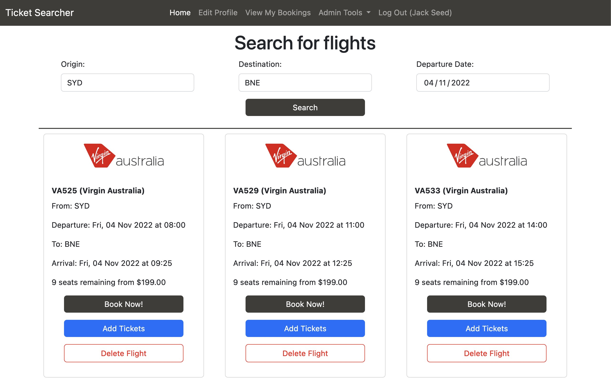

# Ticket Searcher - Project 1
This is a flight ticket searching/booking website that allows user to register an account, search for available flights given the origin, destination and departure date. This is project 1 for the General Assembly Software Engineering Immersive course (SEI57). Consolidating learnings on Ruby on Rails, PostgreSQL, HTML and CSS/Bootstrap. This project is still a work in progress.

You can visit the project by clicking [here](https://project1-ticket-searchr.herokuapp.com/)

## Project Snapshot

---

## Please note:
The flight database is currently using the seed data only. Only very limited flights exist, i.e. MEL/SYD, SYD/MEL, SYD/BNE and BNE/SYD departing 04/11/2022 - 07/11/2022 only. Origin and Destination must be in IATA airport code format.

---

## Languages
* HTML, CSS (including Bootstrap)
* Ruby / Ruby on Rails

---

## Gems used
* Heroku
* wicked_pdf
* wkhtmltopdf-binary
* jQuery-rails
* Bootstrap

---

## Features
* Users - Sign up and sign in with secure password
* Airlines (only available to admins) - full CRUD
* Flights - CR only
* Tickets - CR only
* Associations between users, tickets, flights and airlines
* Search for available flights using origin, destination and departure date
* Browse all flights from search criteria
* Select flight and browse tickets
* Book tickets (association) and view it under your user profile
* Cancel tickets and have it returned to the market

---

## Known Issues
* User redirect-back might not redirect back to the correct page under some circumstances.
* When going back in pages using browser's back function, the data on previous pages do not automatically get refreshed.
* Flights are only searchable using IATA airport code
* Only direct flights are visible at this stage.

---

## Future Plans
* Implement flights API to retrieve real time flight data.
* Implement filter and sort function on flight index page and user existing bookings page.

---

## Special Thanks
Special thanks to Loden ([Github Link](https://github.com/Tenzang)) and Joel ([Github Link](https://github.com/wofockham)), our IA and instructor for SEI57 at General Assembly Sydney, Australia, for their guidance throughout the project.

Also cheers Alex ([Github Link](https://github.com/Anico94)) for numerous suggestions :)